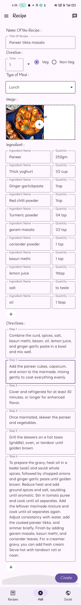
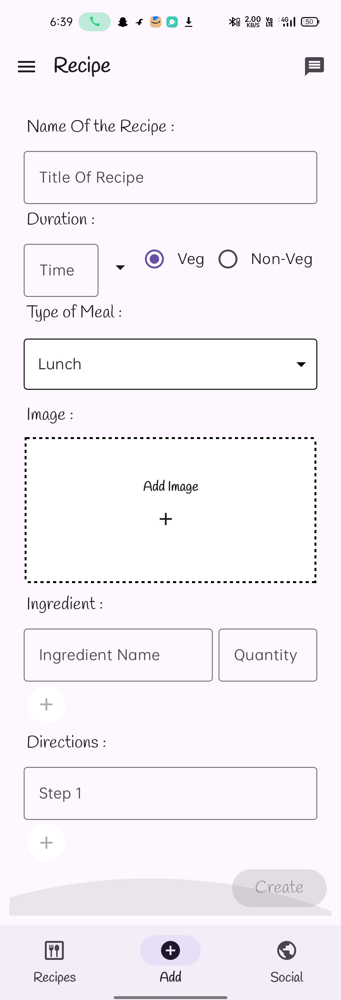
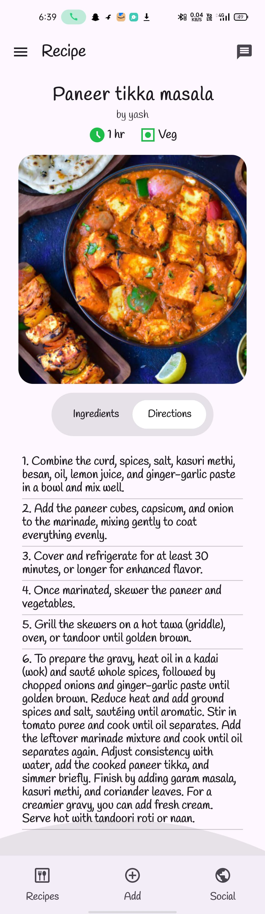
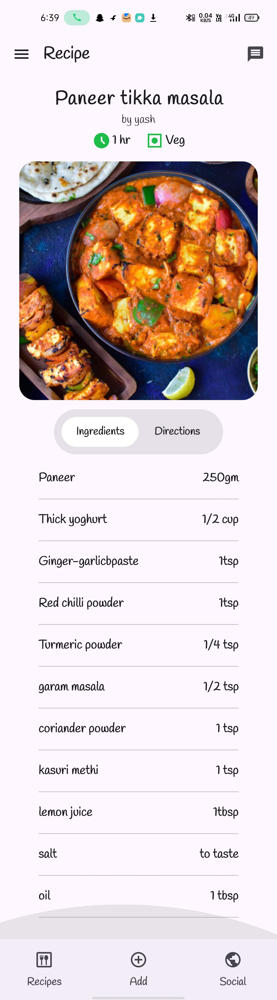

# 🍲 RecipeShare

**RecipeShare** is a beautiful and intuitive Android application built with **Jetpack Compose**, **Room Database**, and **MVI architecture**, designed to help users create, store, and browse their favorite recipes — completely offline.

 ---

## ✨ Overview

 RecipeShare provides a seamless experience for cooking enthusiasts to save their culinary creations. Users can easily add step-by-step instructions, ingredients, and photos for each recipe. All data is stored locally, ensuring full control over your collection even without internet access.

---

## 🚀 Tech Stack

- 🛠️ **Jetpack Compose** – Modern UI toolkit  
- 💾 **Room Database** – Local storage for recipes  
- 🧠 **MVI Architecture** – Unidirectional data flow for better state management  
- 💉 **Hilt** – Dependency Injection  
- ⚙️ **Kotlin** – Primary development language  
- 🖼️ **Image Compression** – For storing optimized recipe images  

 ---

## 🗂️ Key Features

### 📝 Add & Edit Recipes
- Title, ingredients, and preparation steps  
- Add a photo to make your recipe more appealing  
- Recipes are editable and stored offline  

### 🖼️ Image Handling
  - Capture image from camera or select from gallery  
  - Compress images before saving to reduce space usage  

### 📚 View Recipes
- Scrollable list of saved recipes  
- View full recipe details with image  
- Easy navigation with modern Compose UI  

### 🔍 Search & Categorize *(Planned)*
- Search recipes by name or ingredient  
- Categorization based on type (e.g., Dessert, Main Course)  

### 💾 Offline-first
- All data is stored locally using Room  
- No internet connection required  

---

## 🖼️ Screenshots

| Screen             | Preview           |
|--------------------|-------------------|
| Home Screen(empty) | |
| Home Screen(Recipe added) | .jpeg)|
| Add Recipe (empty) | |
| Add Recipe (added) | |
| Recipe Details     | |
| Recipe Details     | |

---

## 📦 Installation

1. Clone the repository:
2. Open the project in **Android Studio**  
3. Run the app on an emulator or physical device  

---

# 📥 Download APK

📲 **[Download Latest APK](https://your-apk-download-link)**

---
